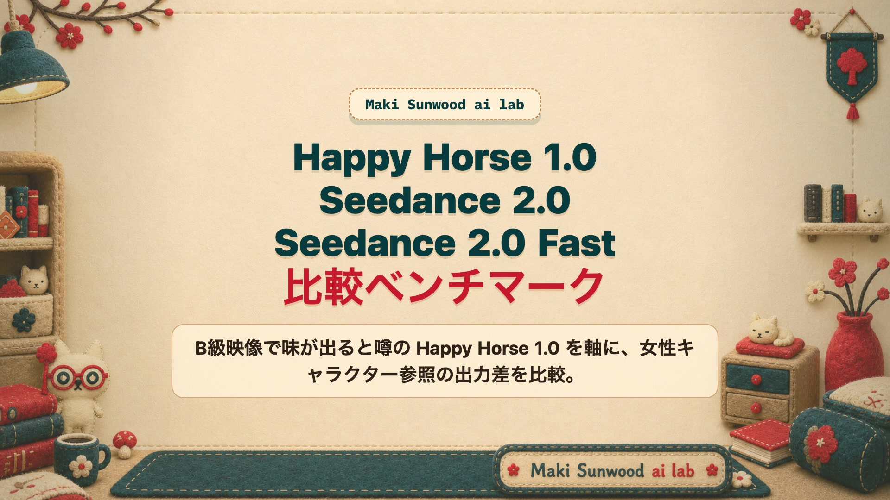
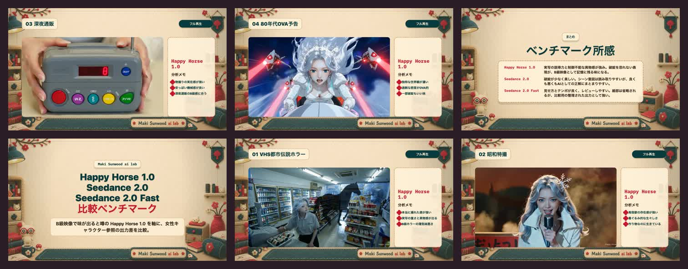
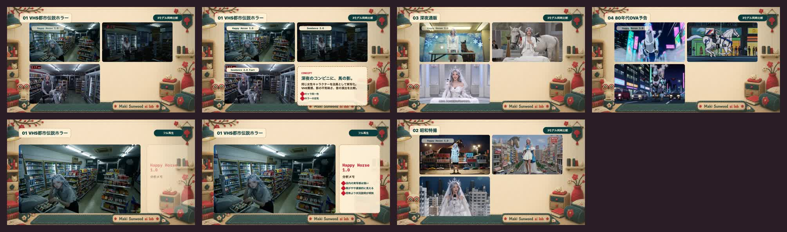
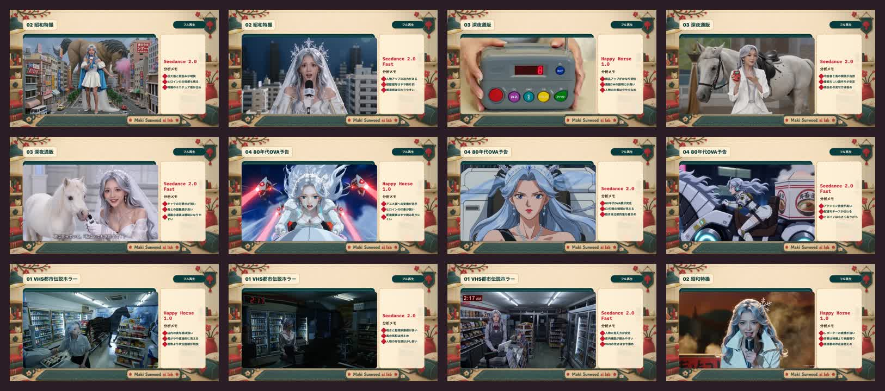
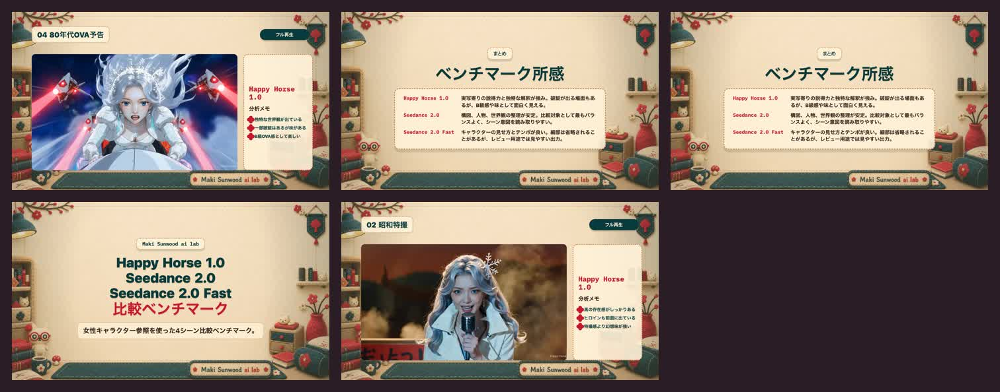

<p align="center">
  
</p>

<h1 align="center">Happy Horse 1.0 vs Seedance 2.0 Benchmark</h1>

<p align="center">
  A reproducible character-reference video benchmark for Happy Horse 1.0, Seedance 2.0, and Seedance 2.0 Fast.
</p>

<p align="center">
  <a href="README.ja.md">日本語</a> | <strong>English</strong>
</p>

<p align="center">
  <a href="https://github.com/Sunwood-ai-labs/happy-horse-seedance-benchmark/actions/workflows/ci.yml"></a>
  <a href="https://github.com/Sunwood-ai-labs/happy-horse-seedance-benchmark/actions/workflows/pages.yml"></a>
</p>

This repository preserves a fixed comparison protocol for the same female character reference across four 15-second concepts. Generation happens on each model platform; this repo handles intake, metadata, reports, review frames, and the HyperFrames comparison composition.

The current benchmark intentionally evaluates more than clean visual quality. Happy Horse 1.0's rough live-action texture, physical oddness, and B-movie charm are treated as part of the comparison surface.

Pages preview: [Happy Horse 1.0 vs Seedance 2.0 Benchmark](https://sunwood-ai-labs.github.io/happy-horse-seedance-benchmark/). The Pages workflow builds, checks, and deploys the static site on every push to `main`.

## 🧪 Models

Model IDs and display names are source-of-truth values from [configs/models.json](configs/models.json). If a provider API name is ambiguous, keep these IDs stable and add context in `notes`.

| ID | Display name | Track |
| --- | --- | --- |
| `happy-horse-1.0` | Happy Horse 1.0 | Baseline |
| `seedance-2.0` | Seedance 2.0 | Quality |
| `seedance-2.0-fast` | Seedance 2.0 Fast | Fast |

## 🎞️ Benchmark Set

The prompt set lives in [configs/prompts.json](configs/prompts.json). Each prompt uses the same baseline conditions:

- `15s`
- `16:9`
- audio enabled
- the same `@image` female character reference
- scene-specific style and scoring focus

The four current concepts are VHS urban-legend horror, Showa tokusatsu, late-night shopping TV, and an 80s OVA trailer.

## ⚙️ Setup

```sh
cd /Users/admin/Prj/happy-horse-seedance-benchmark
uv run python -m vbench models
```

The benchmark CLI uses the Python standard library at runtime. `pytest` is only needed for development checks.

## ▶️ Run Workflow

List the prompts:

```sh
uv run python -m vbench prompts
```

Create an empty run file:

```sh
uv run python -m vbench init-run --run-id smoke-001
```

Register one generated result:

```sh
uv run python -m vbench add-result \
  --run-id smoke-001 \
  --prompt-id vhs-convenience-horse-shadow \
  --model-id seedance-2.0-fast \
  --status ok \
  --latency-sec 42.8 \
  --cost-usd 0.12 \
  --artifact artifacts/smoke-001/seedance-2.0-fast/vhs-convenience-horse-shadow.mp4 \
  --score character_identity=4 \
  --score visual_quality=4 \
  --score motion_quality=3.5 \
  --notes "Character is stable; horse-shadow cue is subtle."
```

Regenerate a Markdown report:

```sh
uv run python -m vbench report --run-id smoke-001
```

The report is written to `reports/<run-id>.md`. Intake details for the current character-reference run are in [docs/incoming-video-intake.md](docs/incoming-video-intake.md).

## 🎬 HyperFrames Comparison

The 4-scene x 3-model comparison video is assembled in HyperFrames:

- Composition: [hf-character-reference-comparison/index.html](hf-character-reference-comparison/index.html)
- Visual design notes: [hf-character-reference-comparison/DESIGN.md](hf-character-reference-comparison/DESIGN.md)
- Artifact policy: [docs/hyperframes-comparison.md](docs/hyperframes-comparison.md)
- Local final render: `hf-character-reference-comparison/renders/all-scenes-comparison.mp4`

Large MP4 files and generated source videos are intentionally not tracked by Git. Keep them local under `artifacts/<run-id>/` or promote them as release assets when distribution is needed.

## 🖼️ Review Frames

These tracked frames prove the layout, copy, analysis notes, and summary slides without committing the full MP4.

| Purpose | Time | Frame |
| --- | ---: | --- |
| Intro title / benchmark intent | 3s | [t3.jpg](hf-character-reference-comparison/renders/review-reflection-check/t3.jpg) |
| VHS / Happy Horse 1.0 analysis | 32s | [t32.jpg](hf-character-reference-comparison/renders/review-reflection-check/t32.jpg) |
| Showa tokusatsu / Happy Horse 1.0 analysis | 96s | [t96.jpg](hf-character-reference-comparison/renders/review-reflection-check/t96.jpg) |
| Late-night shopping / Happy Horse 1.0 analysis | 160s | [t160.jpg](hf-character-reference-comparison/renders/review-reflection-check/t160.jpg) |
| 80s OVA / Happy Horse 1.0 analysis | 224s | [t224.jpg](hf-character-reference-comparison/renders/review-reflection-check/t224.jpg) |
| Summary slide | 266s | [t266.jpg](hf-character-reference-comparison/renders/review-reflection-check/t266.jpg) |









## 📏 Scoring Axes

Metrics are defined in [configs/metrics.json](configs/metrics.json).

- Prompt adherence
- Character identity
- Character consistency
- Temporal consistency
- Motion quality
- Visual quality
- Text/logo stability
- Audio quality
- Style accuracy
- Latency
- Cost

## 🗂️ Repository Layout

```text
configs/       model, prompt, and metric definitions
data/runs/     run JSON files
artifacts/     generated videos and media, kept local by default
reports/       generated Markdown reports and local QC outputs
docs/          benchmark protocol and intake notes
src/vbench/    CLI and report logic
tests/         smoke and config tests
```

## 🛡️ Data Handling

Do not commit API keys, account details, raw generated videos, full MP4 renders, or private provider exports. The `.gitignore` keeps `artifacts/**`, `reports/**`, `data/runs/**`, HyperFrames source videos, and full rendered MP4s local while preserving `.gitkeep` placeholders.

## ✅ Verification

```sh
uv run pytest -q
uv run python scripts/smoke_test.py
uv run python scripts/check_readme_links.py
uv run python scripts/build_pages.py
uv run python scripts/check_pages_site.py
```

Before committing, inspect the staged payload and keep large local media out of Git.
