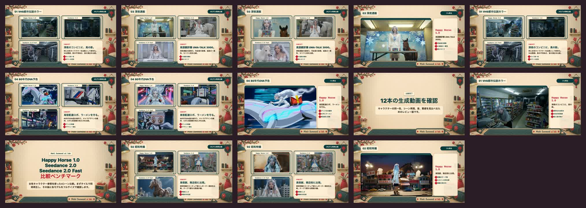

# Happy Horse 1.0 vs Seedance 2.0 Benchmark

<p align="center">
  
</p>

[](https://github.com/Sunwood-ai-labs/happy-horse-seedance-benchmark/actions/workflows/ci.yml)
[](https://github.com/Sunwood-ai-labs/happy-horse-seedance-benchmark/actions/workflows/pages.yml)

ハッピーホース 1.0、シーダンス 2.0、シーダンス 2.0 Fast を同じ条件で比較するためのベンチマーク用リポジトリです。

このリポジトリは、まず「比較条件を固定して記録する」ことを目的にしています。現在のプロンプトセットは、@image の女性キャラクター参照を軸にした 4コンセプト x 15秒 の比較実験です。動画生成そのものは各モデル/各プラットフォーム上で行い、このリポジトリでは生成済み動画の受け取り、メタデータ登録、確認フレーム管理、Markdownレポート化、HyperFrames比較動画化を扱います。

English summary: this repository preserves a reproducible character-reference video benchmark for Happy Horse 1.0, Seedance 2.0, and Seedance 2.0 Fast. The current run focuses on B-movie flavored 15-second scenes where Happy Horse 1.0's rough physicality and strange live-action texture are part of the evaluation, not only defects.

Pages preview target: [Happy Horse 1.0 vs Seedance 2.0 Benchmark](https://sunwood-ai-labs.github.io/happy-horse-seedance-benchmark/)

The Pages workflow always builds and checks the static site. Deployment is skipped while this repository is private on a plan that does not support private GitHub Pages.

## 🧪 比較対象

| ID | 表示名 | 用途 |
| --- | --- | --- |
| `happy-horse-1.0` | Happy Horse 1.0 | ベース比較対象 |
| `seedance-2.0` | Seedance 2.0 | 品質重視の比較対象 |
| `seedance-2.0-fast` | Seedance 2.0 Fast | 速度重視の比較対象 |

## ⚙️ セットアップ

```sh
cd /Users/admin/Prj/happy-horse-seedance-benchmark
```

外部依存を増やさないため、CLI本体は標準ライブラリだけで動きます。ローカルではインストールなしで `PYTHONPATH=src` を付けて実行できます。

## ▶️ 使い方

プロンプト一覧を確認します。

```sh
PYTHONPATH=src python3 -m vbench prompts
```

今回の動画受け取り手順は [docs/incoming-video-intake.md](docs/incoming-video-intake.md) にまとめています。

空のベンチマーク実行ファイルを作ります。

```sh
PYTHONPATH=src python3 -m vbench init-run --run-id smoke-001
```

生成結果を登録します。

```sh
PYTHONPATH=src python3 -m vbench add-result \
  --run-id smoke-001 \
  --prompt-id product-orbit \
  --model-id seedance-2.0-fast \
  --status ok \
  --latency-sec 42.8 \
  --cost-usd 0.12 \
  --artifact artifacts/smoke-001/seedance-fast-product-orbit.mp4 \
  --notes "動きは速いがロゴの安定性は要確認"
```

Markdownレポートを生成します。

```sh
PYTHONPATH=src python3 -m vbench report --run-id smoke-001
```

出力先は `reports/smoke-001.md` です。

## 🎬 最新の比較動画

HyperFrames で、4シーン x 3モデルを1本にまとめた比較動画を作成しています。
今回の見方は、綺麗さだけではなく **B級映像で Happy Horse 1.0 が出す味、実写の説得力、破綻込みの作家性** を重視しています。

- 最終動画（ローカル生成物）: `hf-character-reference-comparison/renders/all-scenes-comparison.mp4`
- HyperFrames composition: [hf-character-reference-comparison/index.html](hf-character-reference-comparison/index.html)
- Visual design notes: [hf-character-reference-comparison/DESIGN.md](hf-character-reference-comparison/DESIGN.md)
- 成果物ポリシー: [docs/hyperframes-comparison.md](docs/hyperframes-comparison.md)

MP4はサイズが大きいため、Gitではソース構成と確認フレームを管理し、完成動画本体はローカル成果物またはRelease assetとして扱います。

## 🖼️ 確認フレーム / QC画像

動画内の文字、タイル配置、分析メモ、まとめスライドを確認するために使った代表フレームです。README上でもすぐ確認できるように残しています。

### 確認用フレーム一覧

| 用途 | 時刻 | 画像 |
| --- | ---: | --- |
| 冒頭タイトル / ベンチマーク意図 | 3s | [t3.jpg](hf-character-reference-comparison/renders/review-reflection-check/t3.jpg) |
| VHS / Happy Horse 1.0分析 | 32s | [t32.jpg](hf-character-reference-comparison/renders/review-reflection-check/t32.jpg) |
| 昭和特撮 / Happy Horse 1.0分析 | 96s | [t96.jpg](hf-character-reference-comparison/renders/review-reflection-check/t96.jpg) |
| 深夜通販 / Happy Horse 1.0分析 | 160s | [t160.jpg](hf-character-reference-comparison/renders/review-reflection-check/t160.jpg) |
| 80年代OVA / Happy Horse 1.0分析 | 224s | [t224.jpg](hf-character-reference-comparison/renders/review-reflection-check/t224.jpg) |
| まとめスライド | 266s | [t266.jpg](hf-character-reference-comparison/renders/review-reflection-check/t266.jpg) |
| VHS タイル配置の早い時点 | 10.8s | [t10_8.jpg](hf-character-reference-comparison/renders/frame-alignment-check/t10_8.jpg) |
| VHS タイル配置の安定時点 | 12s | [t12.jpg](hf-character-reference-comparison/renders/frame-alignment-check/t12.jpg) |
| VHS フル再生の早い時点 | 25.8s | [t25_8.jpg](hf-character-reference-comparison/renders/frame-alignment-check/t25_8.jpg) |
| VHS フル再生の安定時点 | 27s | [t27.jpg](hf-character-reference-comparison/renders/frame-alignment-check/t27.jpg) |
| 昭和特撮 タイル配置 | 74.8s | [t74_8.jpg](hf-character-reference-comparison/renders/frame-alignment-check/t74_8.jpg) |
| 深夜通販 タイル配置 | 138.8s | [t138_8.jpg](hf-character-reference-comparison/renders/frame-alignment-check/t138_8.jpg) |
| 80年代OVA タイル配置 | 202.8s | [t202_8.jpg](hf-character-reference-comparison/renders/frame-alignment-check/t202_8.jpg) |

### レビュー反映確認

Happy Horse 1.0 のB級映像的な味、各Happy Horse分析メモ、まとめスライドの反映確認。


個別フレーム:

- [Intro](hf-character-reference-comparison/renders/review-reflection-check/t3.jpg)
- [VHS / Happy Horse 1.0](hf-character-reference-comparison/renders/review-reflection-check/t32.jpg)
- [Showa Tokusatsu / Happy Horse 1.0](hf-character-reference-comparison/renders/review-reflection-check/t96.jpg)
- [Late-night Shopping / Happy Horse 1.0](hf-character-reference-comparison/renders/review-reflection-check/t160.jpg)
- [80s OVA / Happy Horse 1.0](hf-character-reference-comparison/renders/review-reflection-check/t224.jpg)
- [Summary slide](hf-character-reference-comparison/renders/review-reflection-check/t266.jpg)

### タイル配置 / フレーム確認

タイル比較シーンでは、動画まわりの装飾枠を外し、2x2配置の動画と右下コンセプトカードだけにしています。


個別フレーム:

- [VHS tile early](hf-character-reference-comparison/renders/frame-alignment-check/t10_8.jpg)
- [VHS tile stable](hf-character-reference-comparison/renders/frame-alignment-check/t12.jpg)
- [VHS full early](hf-character-reference-comparison/renders/frame-alignment-check/t25_8.jpg)
- [VHS full stable](hf-character-reference-comparison/renders/frame-alignment-check/t27.jpg)
- [Showa tile](hf-character-reference-comparison/renders/frame-alignment-check/t74_8.jpg)
- [Shopping tile](hf-character-reference-comparison/renders/frame-alignment-check/t138_8.jpg)
- [OVA tile](hf-character-reference-comparison/renders/frame-alignment-check/t202_8.jpg)

### 個別分析メモ

各モデルのフル再生パート右側に入れた、生成物への短評確認。


### 全体QC

主要シーンを横断したコンタクトシート。



### 最終文言確認

冒頭タイトル、Happy Horse 1.0の特撮/OVA分析、まとめスライドなどの文言確認用。


## 📏 評価軸

`configs/metrics.json` に定義しています。

- Prompt adherence: 指示への忠実度
- Character identity: @image の女性キャラとして認識できるか
- Character consistency: 15秒間の人物一貫性
- Temporal consistency: フレーム間の一貫性
- Motion quality: 動きの自然さ
- Visual quality: 画質、質感、破綻の少なさ
- Text/logo stability: 文字やロゴの安定性
- Audio quality: 音楽、効果音、セリフ、ナレーション
- Style accuracy: コンセプト別の様式再現性
- Latency: 生成完了までの時間
- Cost: 生成コスト

## 🗂️ ディレクトリ

```text
configs/       モデル、プロンプト、評価軸
data/runs/     実行結果JSON
artifacts/     生成動画や画像などの成果物
reports/       集計レポート
src/vbench/    CLIと集計ロジック
tests/         最低限の検証
```

## 🧭 次に足すもの

- 各プラットフォームで生成した動画の受け取り手順の追加
- 人手評価フォーム
- 画像・動画の自動メトリクス
- 複数runの横断ランキング

## ✅ 検証

```sh
python3 scripts/smoke_test.py
python3 scripts/check_readme_links.py
python3 scripts/build_pages.py
python3 scripts/check_pages_site.py
```
